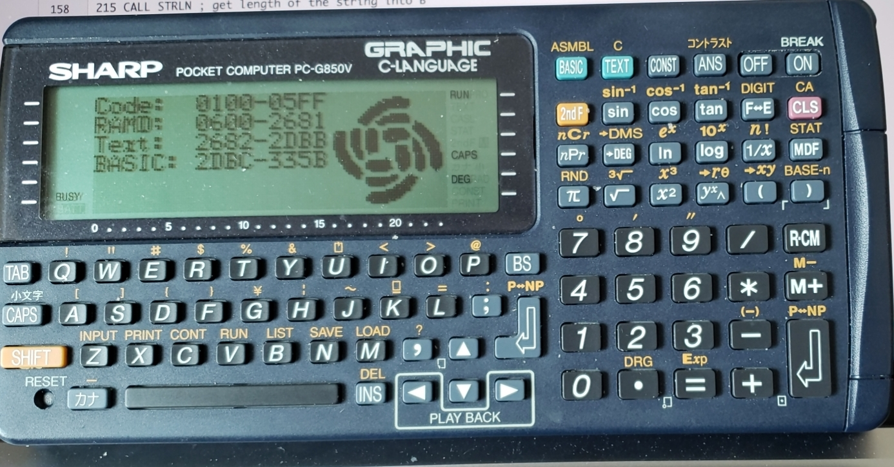
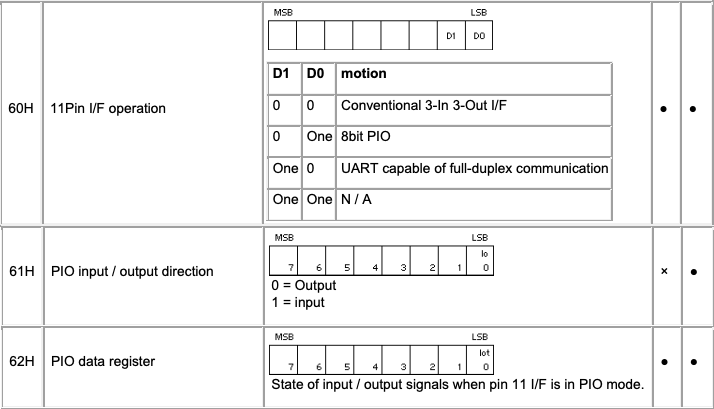
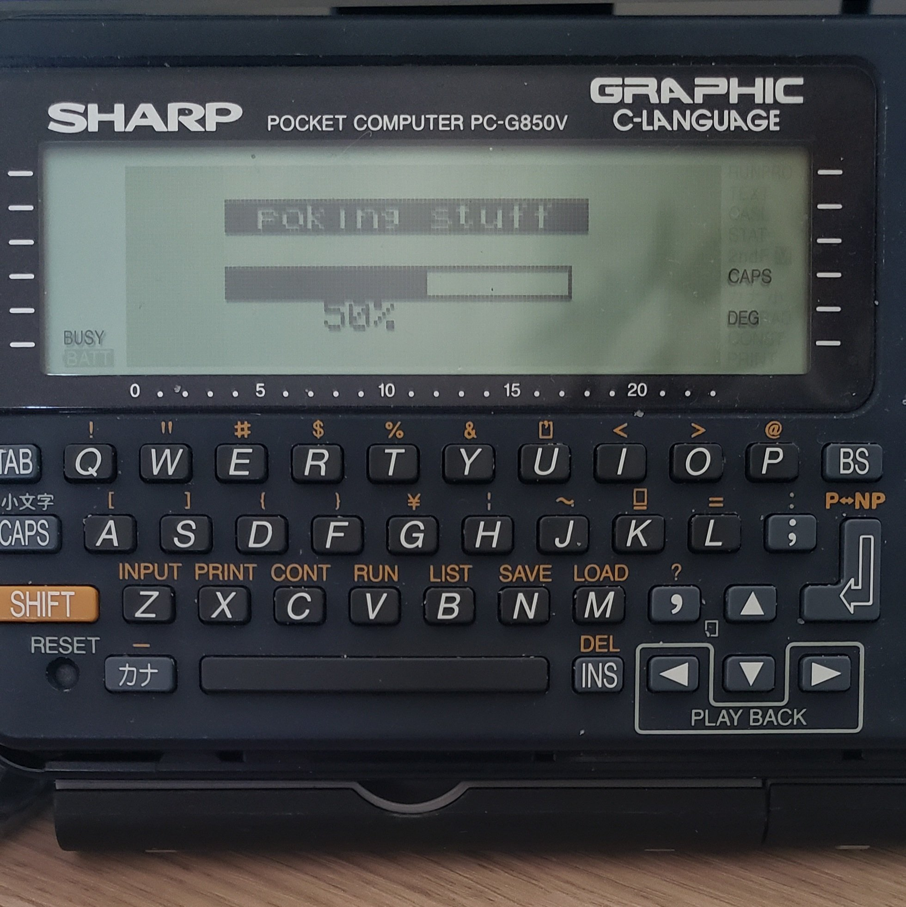
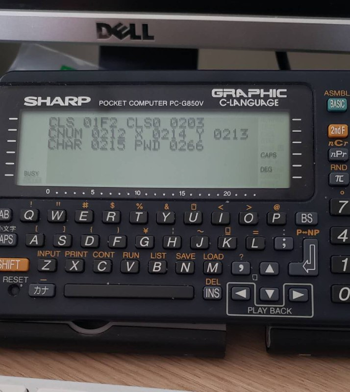

# A SHORT ASM DOCUMENTATION

## This README documents my ASM code, since memory is limited on the Sharp.

I don't want to overcrowd my code files with comments – space is at a premium on the Sharp... So I am documenting stuff here instead.

- The code uses (un)documented ROM routines. These are named for readability, but it's not exactly scintillating. Known routines are documented below.

- People who come from "modern" language might find some concepts weird (like flag-based comparisons). I'll try to explain these.

- Library of subroutines. In order to avoid reinventing the wheel, I am writing code so as to be reusable. I'll document these routines here.

## ROM routines

- **REGOUT EQU 0BD03H**

 It clears the screen (need to find THAT routine), displays the contents of all registers, then waits for the user to press a key. Useful when debugging.

- **DSPDE EQU 0BFF1H**

 In the same vein, this one displays DE, and waits for a key to be pressed.

- **AOUT EQU 0BD09H**

 Same for A.

- **AOUTSR EQU 0BFAFH**

 Same again for A, but to Serial.

- **HLOUT EQU 0BD0FH**

 Same for HL.

- **HLOSR EQU 0BFB2H**

 Same again for HL, but to Serial.

- **INKEY EQU 089BEH**

 Polls the keyboard and puts in A the key (from the Key Matrix). A = 0 ==> no key pressed.
```ASM
250LOOP0: CALL INKEY
260 CP 0
270 JP Z, LOOP0
```
 Waits for a key to be pressed.
 - `CALL INKEY` ==> polls keyboard and puts result in A.
 - `CP 0` ==> compares A with 0.
 - `JP Z, LOOP0` ==> If flag is Zero (true), go back to LOOP0.

- **GETCHR EQU 0BCFDH (088C1H)**

 INKEY gives you the key according to the key matrix. This gives you the real character. Used to do real user input (as opposed to press a key to continue kind of things).

- **PUTCHR EQU 08440H**

 Displays the ASCII(ish) char in A at position ED (E=x, D=y, so reverse order).
```ASM
100 LD A, 058H
510 LD DE, 00205H
516 CALL PUTCHR
```
 This displays an X at position x=5, y=2 (column 6, line 3). The `CLS` function I wrote uses this intensively.

- **INITSR EQU 0871AH**

- **OPENSR EQU 0BCE8H**

- **CLOSSR EQU 0BCEBH**

 These 3 functions initialize, open and close the serial port (11-pin). They're very very useful.

- **LRDSR EQU 0BD15H**

 Reads a line into HL until EOL or EOF is detected, or there's an error.

- **WSTSR EQU 0BFB2H**

 The reverse – writes a 0x00-terminated string to Serial.

- **0BCDFH / 0BCE2H / BCE5H**

 I haven't named them yet, and the docs aren't that clear, but they read a char from Serial. The first one waits a short amount of time, the latter 2 indefinitely. I have used the last one with success.

- **WAITK EQU 0BFCDH**

 Same for keyboard. Waits until a key is pressed, result stored in A.

- **DSPHEX EQU 0F9BDH**

 Converts the contents of A (8-bit value) to a 2-char HEX (ASCII) string, positioned at HL. Much better than doing it yourself, believe me...

There are others, but I haven't used them yet – or some didn't work as advertised. tbc...

## My routines

- **CLS**

```ASM
500CLS: LD B, 6 ; 6 lines
502 LD DE, 0
504CLS1: PUSH BC ; B is used both for line and column [DJNZ]. So the line is saved in the stack
506 LD B, 24 ; 24 chars per line
508CLS2: LD A, 32 ; ' '
510 PUSH BC
512 PUSH DE
514 PUSH HL
516 CALL PUTCHR ; writes A (ie 32, ie ' ') to the screen at pos E,D
518 POP HL
520 POP DE
522 POP BC
524 INC E ; Increment pos X
526 DJNZ CLS2 ; Very powerful: decrement B and go if non-zero
528 INC D ; Increment pos Y
530 LD E, 0
532 POP BC ; B is used both for line and column [DJNZ]. So the line is saved in the stack
534 DJNZ CLS1
536 RET
```

Clears the screen. Haven't found yet the ROM routine that does that...

- **DSPSTR**

```ASM
210 LD HL, L0 ; beginning of the string
215 CALL STRLN ; get length of the string into B --> See next function
220 LD HL, L0 ; beginning of the string
230 LD DE, 00100H ; Y/X position [0-5, 0-23]
240 CALL DSPSTR ; call the routine

[...]

600DSPSTR: LD A, (HL) ; Same principle as CLS, really
610 INC HL
620 PUSH BC
630 PUSH DE
640 PUSH HL
650 CALL PUTCHR ; writes A (ie 32, ie ' ') to the screen at pos E,D
660 POP HL
670 POP DE
680 POP BC
690 INC E
700 LD A, E
710 SUB 24 ; This is how you do a comparison
720 JP M, SKIP0 ; deduct 24: if the result is negative you haven't displayed 24 chars yet.
730 INC D ; increment y pos
740 LD E, 0 ; reset x pos to 0
750SKIP0: DJNZ DSPSTR ; decrement B (char count) and loop if any left
760 RET
```

- **STRLN**

```ASM
210 LD HL, L0 ; beginning of the string
215 CALL STRLN ; get length of the string into B

[...]

1000STRLN: LD B, 0 ; char count initialized at 0
1010STRLN0: LD A, (HL) ; load current char pointed to by HL
1015 CP 0 ; Is it a zero? aka EOL?
1020 JP Z, STRLN1 ; Ayuh. Bail
1030 INC HL ; Increment HL
1040 INC B ; Increment count
1050 JP STRLN0 ; Loop
1060STRLN1: RET
```
## Logos

The `raklogo2.asm` demonstrates 2 things:

1. Display of graphics in ASM: FAST!
2. Creation of said graphics with the [BMP.html](./BMP.html) utility.

It is used in `memls.bas` to display the logo on the right side while displaying system info on the left two-thirds. The code has to assembled before running the BASIC code.



If you want to use `memls.bas` without a logo, remove the CALL 256 line.

## Varia

- **PWD.asm**

This little piece of code enables you to retrieve the password if the Sharp is in protected mode. A simple `CALL 256` will do the trick.

- **BASLIB.asm**

A small ASM library for BASIC (work in progress).

Useful functions are put together and running the ASM app will display the important addresses on the screen. Make a note of that (you know about pen and paper, RIGHT?), and use the addresses (`CALL` for functions, `POKE` to set variables) in your BASIC code.

- **timer.asm**

This little ASM app was requested by [HWR0](https://github.com/hwreverse). Since there are 3 versions of the Sharp PC-G850 (850, 850V, 850VS), we want to see how they compare, speed-wise. Easy peasy: he has an oscilloscope, so we can wiggle the pokekon's butt, aka fiddle with the 11-pin serial port. The idea is to flip a pin on and off on a slow loop, and he'll measure. We have the exact number of cycles the benchmark uses, so that can give us a good idea of the CPU speed.

This code uses 3 ports: 60H to 62H.



60H decides how the 11-pin port is going to function. 61H assigns input/output direction for each of the 8 possible pins (remember this 11-pin port is nc/vcc/gnd + 8 pins, and is multi-function). Finally 62H is the PIO data register, ie an 8-bit parallel port. Send a byte to this port to set all 8 pins.

Between switching the first pin HIGH and LOW, the code loops around, going nowhere in a hurry.

```assembly
4030 LD A,0 ; 256 times: from 0 to 0
4040MLP01: PUSH AF
4050 LD A,0 ; 256 times: from 0 to 0
4060MLP00: PUSH AF
4070 LD HL,LOOP0
4080 LD DE,LOOP1
4090 LD BC,32
4100 LDIR ; copy 32 bytes, 1 by 1
4110 POP AF
4120 DEC A ; inner loop
4130 JP NZ,MLP00
4140 POP AF
4150 DEC A ; outer loop
4160 JP NZ,MLP01
```

This takes about 6.5 to 7 seconds at regular speed, and twice as much when clock speed is halved. A menu after the first run offers the 8 and 4 options. Q to exit, and any other key to keep going.

- **PBAR.asm**

This is a progress bar in ASM (there is an equivalent in BASIC, much much slower). The BASIC version is much more flexible (you pass a size and a percentage, and the PBar can be displayed anywhere at pixel offset x,y), whereas the ASM version is constrained to char positions (x:0,23, y:0,5), and you have to do your own calculations: if your PBar is 96 pixels wide, and you want 10% displayed, you have to tell the function that you want a 4 (or 5) pixel-wide band. I'll add code to take care of this but divisions in ASM suck. But if you want a speedy progress bar, that's the ticket.

- **LABEL.asm**

This is a label in ASM: The idea originally was to draw a text, and surround it with a box, like an emoty PBar. Turns out, it wasn't looking too good, because the top and bottom pixels of the box are also the top and bottom pixels of the characters. So instead I invert all the pixels within the label, making sure the top and bottom pixels stay black. This is done by:

1. Draw the string
2. Read the string's pixels into a buffer
3. XOR (invert) and OR (set bits):

```assembly
1280 XOR 7EH
1290 OR 81H
```
4. Display the buffer

Works like a charm. Most of the calculations are done by the code too, so all you have to provide is a string, a length, an XY position, and the code takes care of the rest. Note the cute hack to multiply by 6 (A characters times 6 pixels = label width):

```assembly
1090 ADD A,A ; B*2
1100 LD C,A
1110 ADD A,A ; B*4
1120 ADD A,C ; B*6
```



- **FNKEYS.asm**

Previous models like the PC-1480U have physical Function Keys. Well then let's make do at the expense of a line on the screen: after the PC-G850V's screen has 2 more lines... The code reuses the code for Labels, so that's hmmm, economical. You can reuse the LABEL code, adding a few more variables. The sample code displays 6 keys and shows what's been pressed.

I'll more UI elements as the need arise.

### functions

- `CLS`/`CLS0`

CLS is probably not THAT exciting (as the BASIC command will probably do the same), but it meshes with `CLS0`, which is parametrable:

* What char to use: space for CLS, or maybe another char to fill the screen with something. Variable [`CHAR`]
* X, Y: Start position. Useful if you want to do, as I do in LORA.BAS, half-screen erases. Variables [`CLSX`, `CLSY`]
* Char num: number of repeats; a full CLS is 144, half a screen 72, etc. Variable [`CLSN`]

- `GETPWD`

The password utility mentioned above. It uses the CLSX, CLSY variables for positioning. It displays "pwd: "+password (if any).


