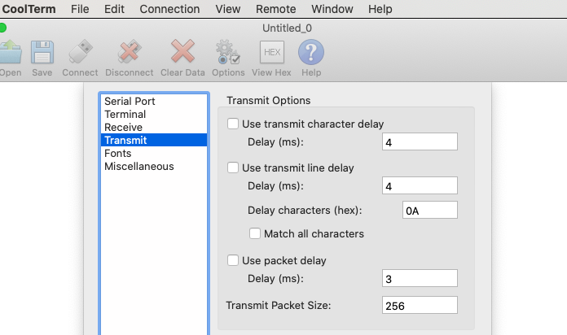

# LoRa.asm

An attempt to produce a LoRa messenger on my Sharp PC-G850* (G850, G850V, G850S), with a [BastWAN](https://electroniccats.com/store/bastwan/) (for now, and later just a [RAK4260 chip](https://store.rakwireless.com/products/rak4260-lora-module?variant=31767005757485)), and my [LoRa Minimal Firmware](https://github.com/Kongduino/BastWAN_Minimal_LoRa). The current iteration is almost ready for real-life tests, and uses the following:

* An external RAM card to store messages
* A [serial adapter](https://github.com/hwreverse/PokeConSerial/tree/master/g850_kiss) by [HWR0](https://github.com/hwreverse) that enables me to code on my Mac and transfer source code or binhexed binaries to the pokekon.
* A custom version of that adapter that enables me to connect a [BastWan](https://store.rakwireless.com/products/rak3244-bastwan-breakout-board) to send and receive LoRa packets via the firmware I wrote for it.

## Status

* Serial connection works properly now, both ways. The firmware receives shortcut commands (eg `S12` for "set SF to 12"), and has a non-verbose mode to talk to the pokekon. In verbose mode, it is mostly useful for humans receiving everything in a serial console – I recommend [CoolTerm](https://freeware.the-meiers.org/) – to check what's *really* happening.
A point of note – while CoolTerm works muy bueno as is when sending source code via the Send Text command, sending messages manually from the Send String window (I use CoolTerm as a "debug" BastWan) works too fast: I introduced a delay of 3~4 ms per character and it helps a lot. Likewise, to send `.ihx` files with the `R` command in the MONitor, adding a 4 ms line-transmit delay solved my issues.



* Messages are properly stored in the external RAM card, 128 bytes per, in the first bank of 32 KB. This gives a 256-message storage capacity. The code being
 8-bit, the storage rotates semi automatically back to 0 (0xFF + 1 = 0x00) and the next-message storage space is readjusted to 0x8000 if message number is 0.


* After writing a proper code lib to manage the external RAM, RAMDISK.asm (a misleading name, that) the code was ported back to LoRa.asm, and after adjustmen
ts, seems to work well. Messages are stored where they should be. They are displayed properly when the ENTER key is pressed.
* There are 4 pieces of code doing the storage / retrieval of external RAM data: RAMON/RAMOFF (which you shouldn't call unless you have specific needs), and
BANK2R / R2BANK, which are preset at 32 bytes (to test, they should be 128), and can be changed anyway with:

```as
LD A,n
LD (BANK2R+1),A
```

Self-modifying code is scary, use carefully.
* ORG is set at 0x400 to leave space for RAMDISK.asm. It is used in conjunction with RAMTEST.bas, and the BASIC code calls ASM code – I need the addresses to be static. So RAMDISK.asm lives at the top, from 0x100.
* WEHT code (wait, Thai pronunciation ;-) I needed code to wait a certain amount of time. WEHT waits 1 milliseconds, thereabouts, BWEHT takes B as a number o
f milliseconds (up to 256, aka 0, of course), and VBWEHT presets BWEHT to 250, aka 1/4 second. I'm using this (4 to 6 times VBWEHT) to show temporary debug m
essages.
* Serial: in order to be able to be notified of incoming traffic, I am not using the ROM routines, but direct PORT code, which has the inconvenient to requir
e a little more work. PUTSR1 sends a string, PREPSR opens the serial interface, and receiving is done manually, see around RECV4.
* There's a PUTBNR method that centers a string on line E. Useful for headers.

## Stuff that doesn't work
* Navigation in the mailbox is screwy.
* ?

## TODO

* Fix the bug above.
* Navigation is ANYWAY limited to 4 messages, I need to implement scrolling down beyond message #4.
* Messaging that goes beyond PING.
* Missing settings – I have more options in the LoRa Minimal firmware.
