# RAMTEST.BAS & RAMDISK.ASM

These 2 pieces of code work together with an external RAM card made by [HWR0](https://github.com/hwreverse). I has 2 banks of 32 KB, and I am using here one, leaving the other one to some other uses. I need storage for messages in [LoRa.asm](../LoRa.asm), and this card came in handy. So after writing ad-hoc code that gave me heartburn, I decided to write proper code, with a monitor in BASIC, so that I could see what happened. Once the code for this worked, I could re-integrate it into `LoRa.asm`. Since the BASIC code in [RAMTEST.BAS](../RAMTEST.BAS) needs to call ASM code, I had to make sure the addresses stay the same, and if they change, to have a way to get the new addresses.

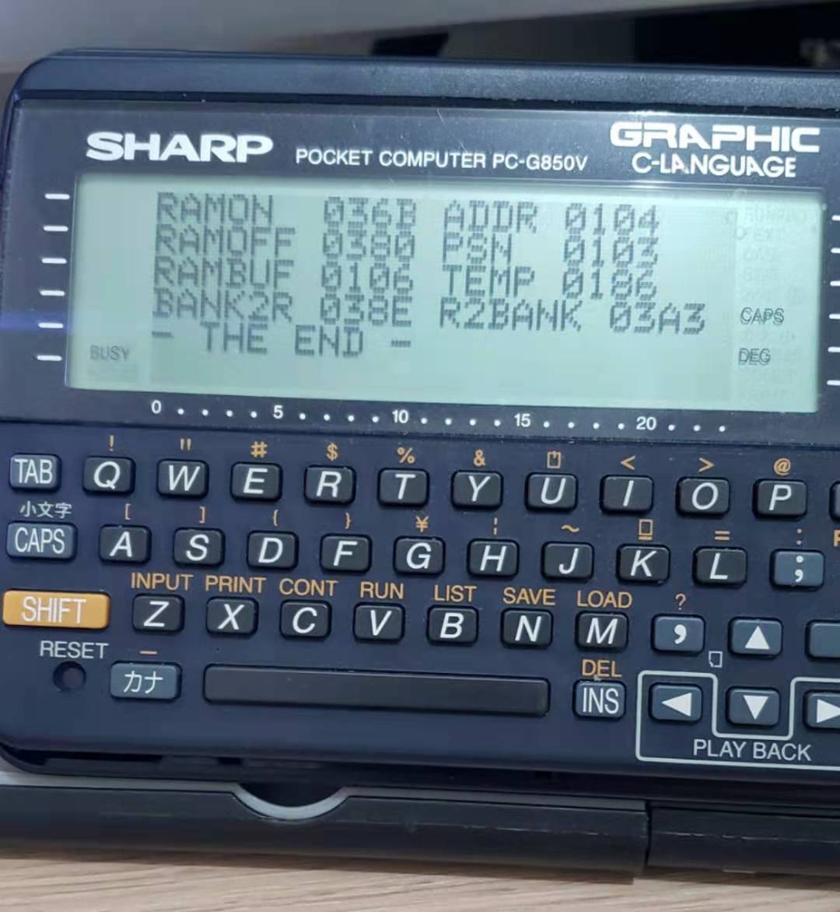

So I moved `LoRa.asm` to 0400H, and stuck [RAMDISK.ASM](../RAMDISK.ASM) to 0100H. The `MAIN` entry point provides addresses for the BASIC code. So I have no excuses for messing up... ;-) The BASIC code provides the UI part of the app, and the ASM code the actual work of moving bytes between the RAM card and a buffer.

`BANK2R` and `R2BANK` are self-explanatory. This version picks up an address from `ADDR`, and uses `BUFFER` as a local buffer. `B` is loaded by default with 24 bytes (which is what can be displayed on the screen), and Bob's your Uncle. This could be adapted to other requirements.

There's a basic (haha) help menu, called by hitting `H`. All memory actions are meant to start at the topmost byte. I'll implement more fine-grained control later. Commands are:

* [H]ELP
* [Q]UIT
* [Z]ERO OUT
* [F]ILL OUT
* [G]O TO ADDRESS
* [J/K] GO DOWN / UP 24 BYTES
* [↓/↑] GO DOWN / UP 4 BYTES
* [B]ANK NUMBER

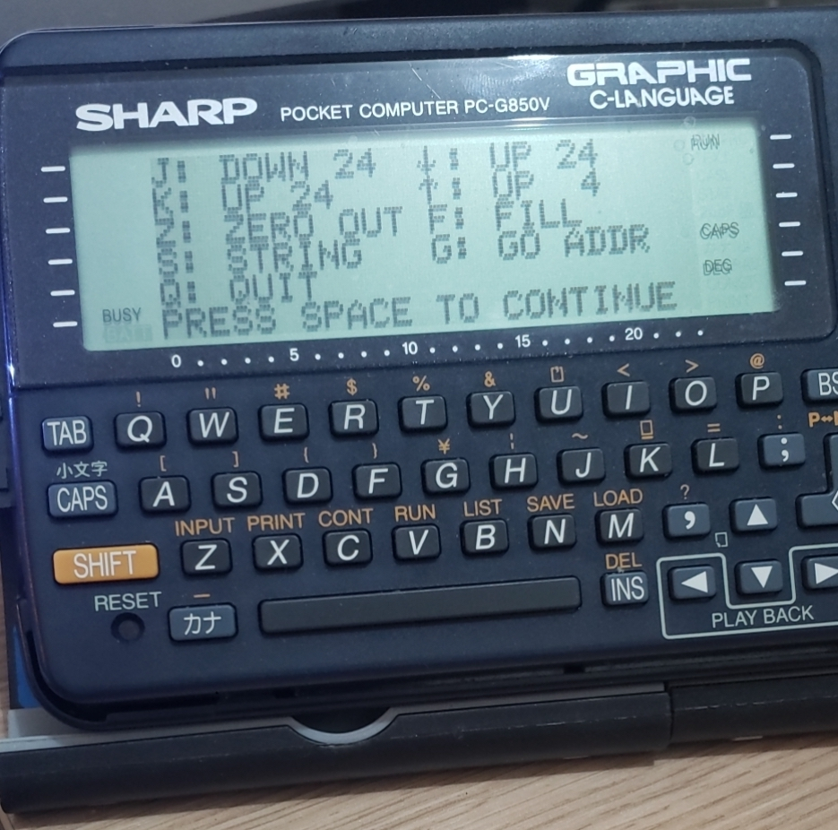
⇒ The Help menu

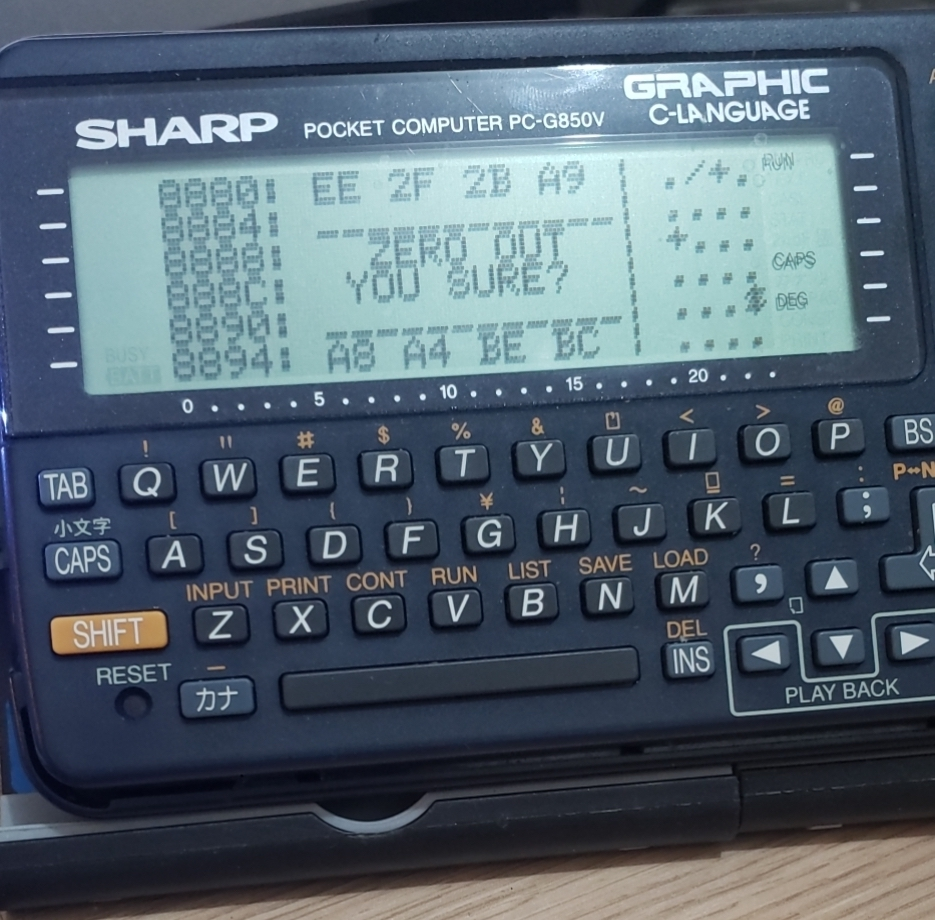
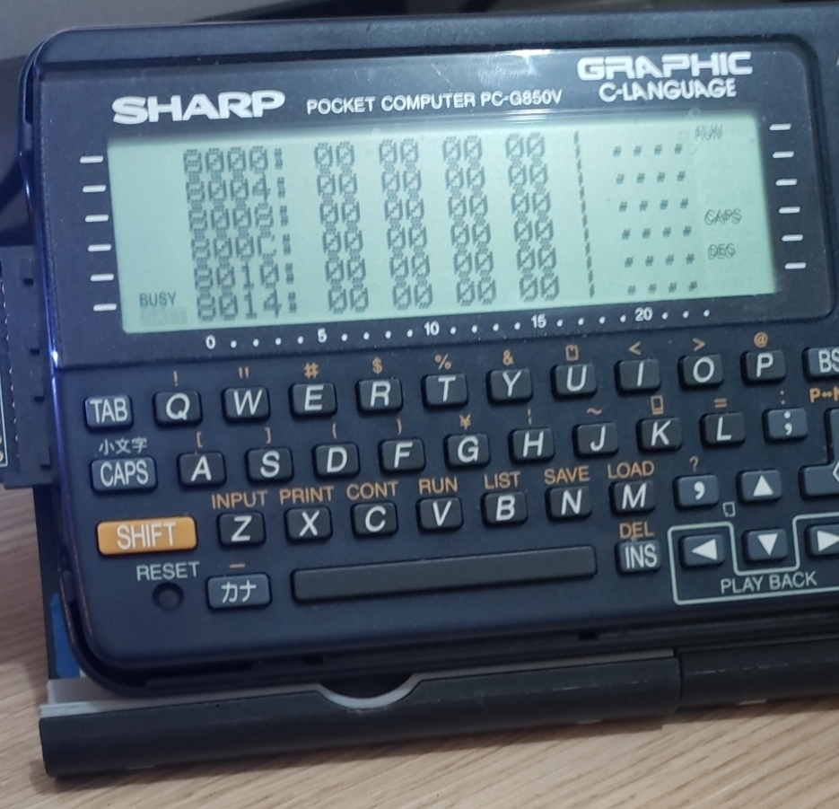
⇒ Zeroing out an area

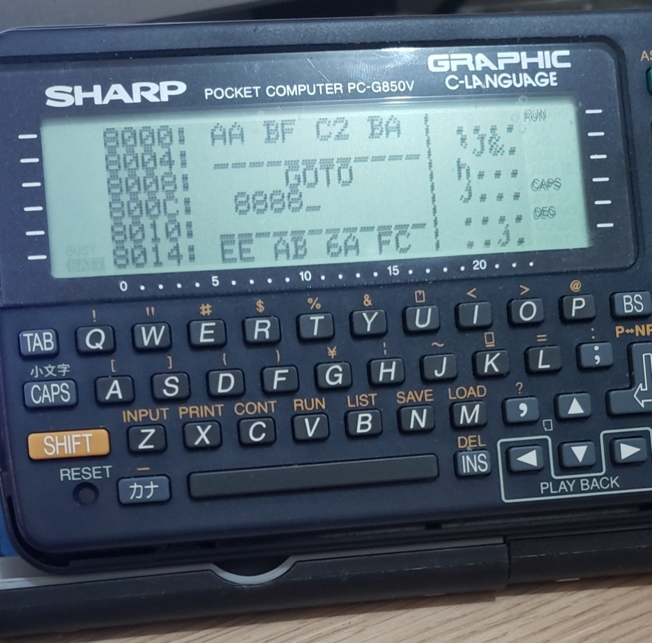
⇒ Going to an address

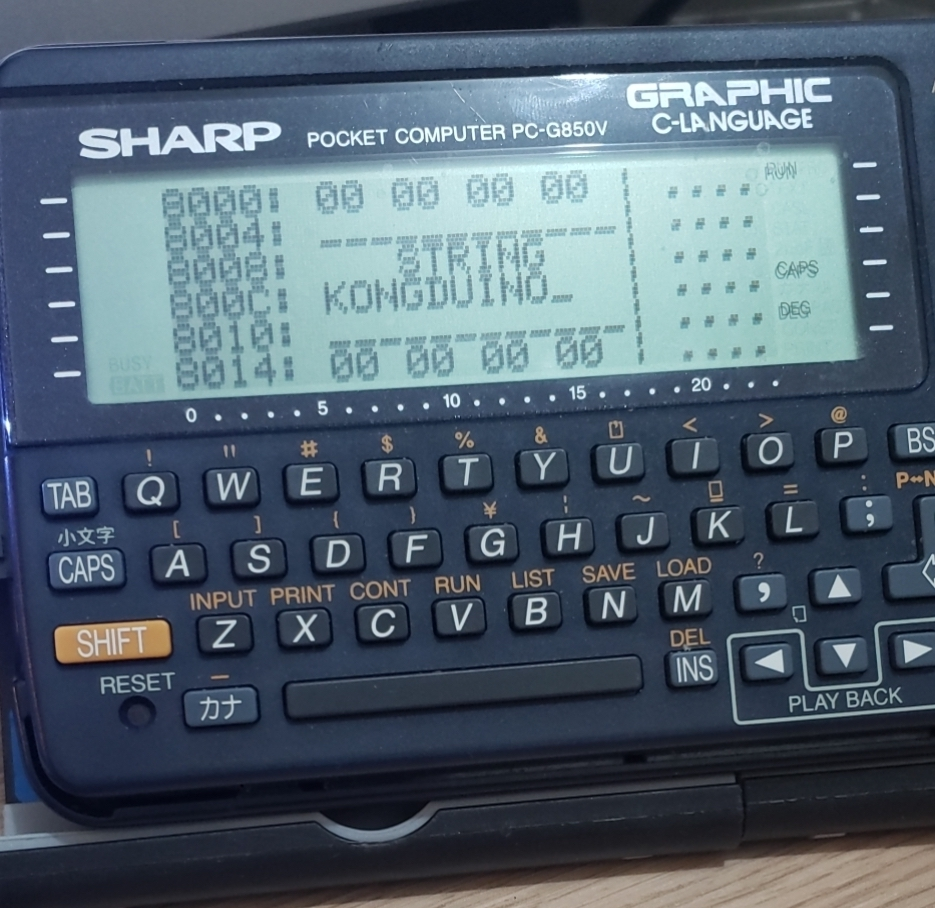
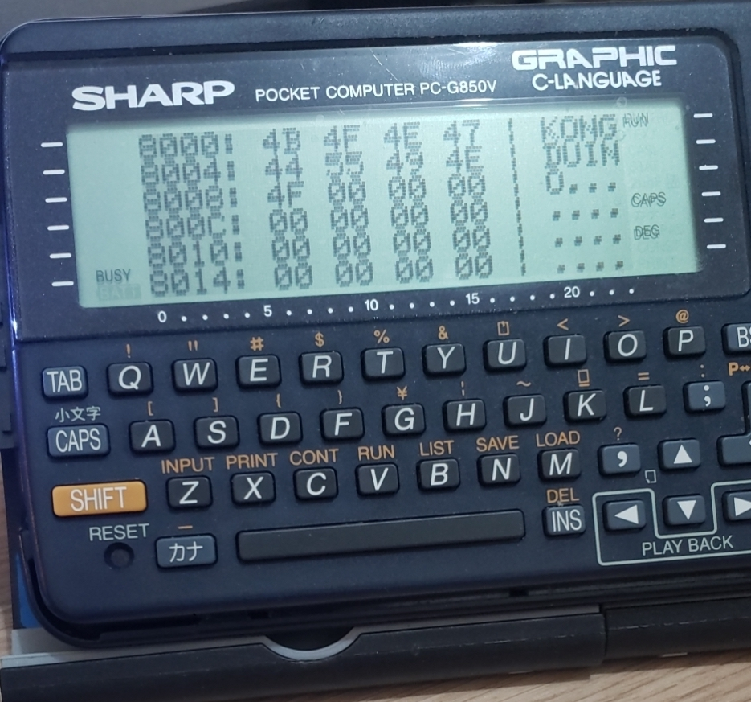
⇒ Entering a string

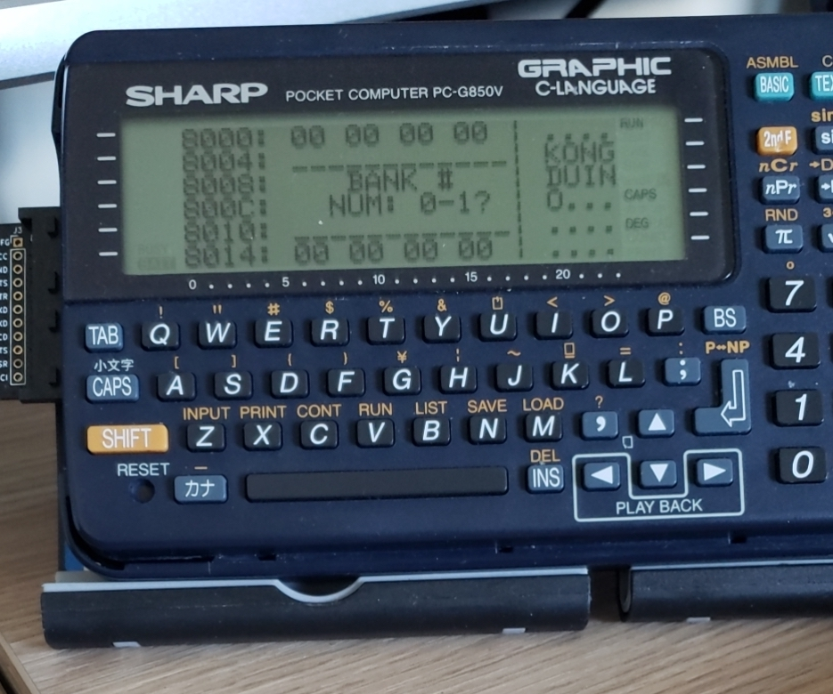
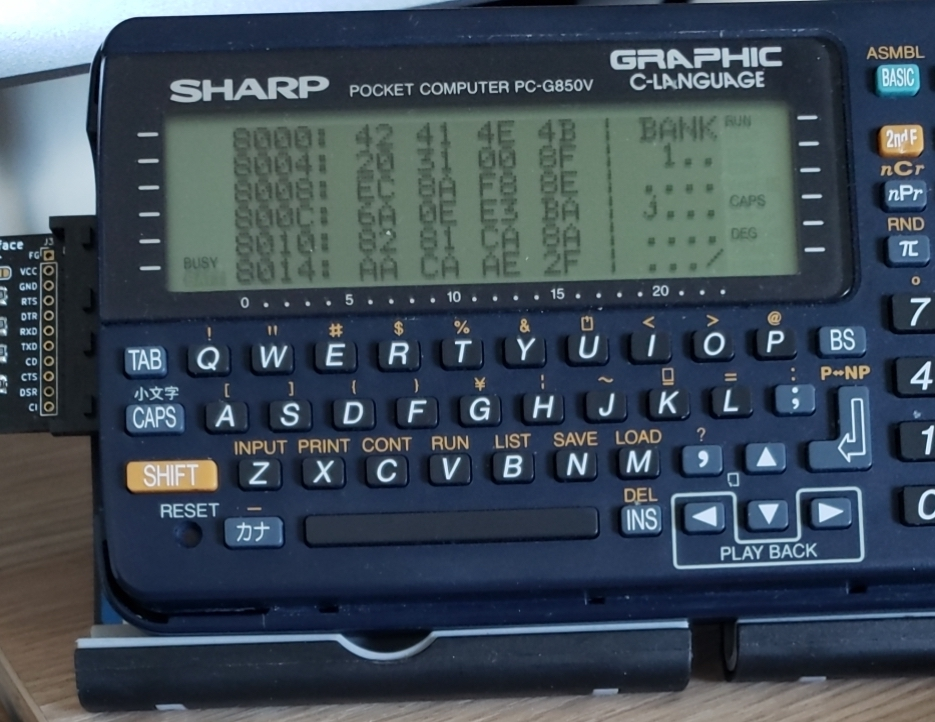
⇒ Changing RAM banks

## The Card

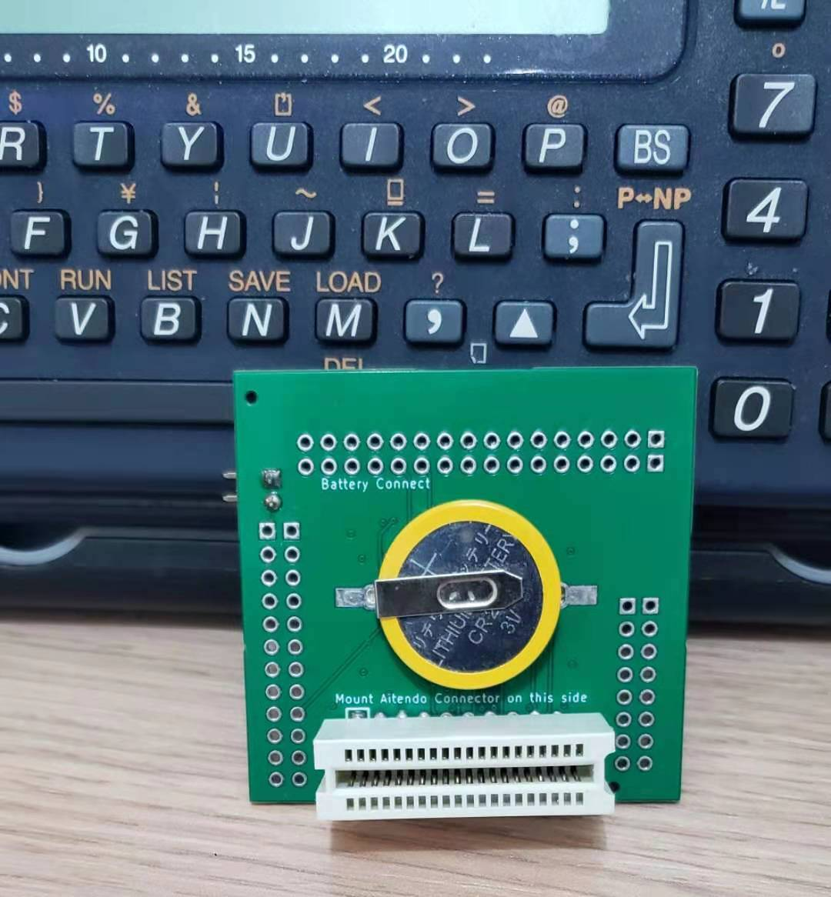
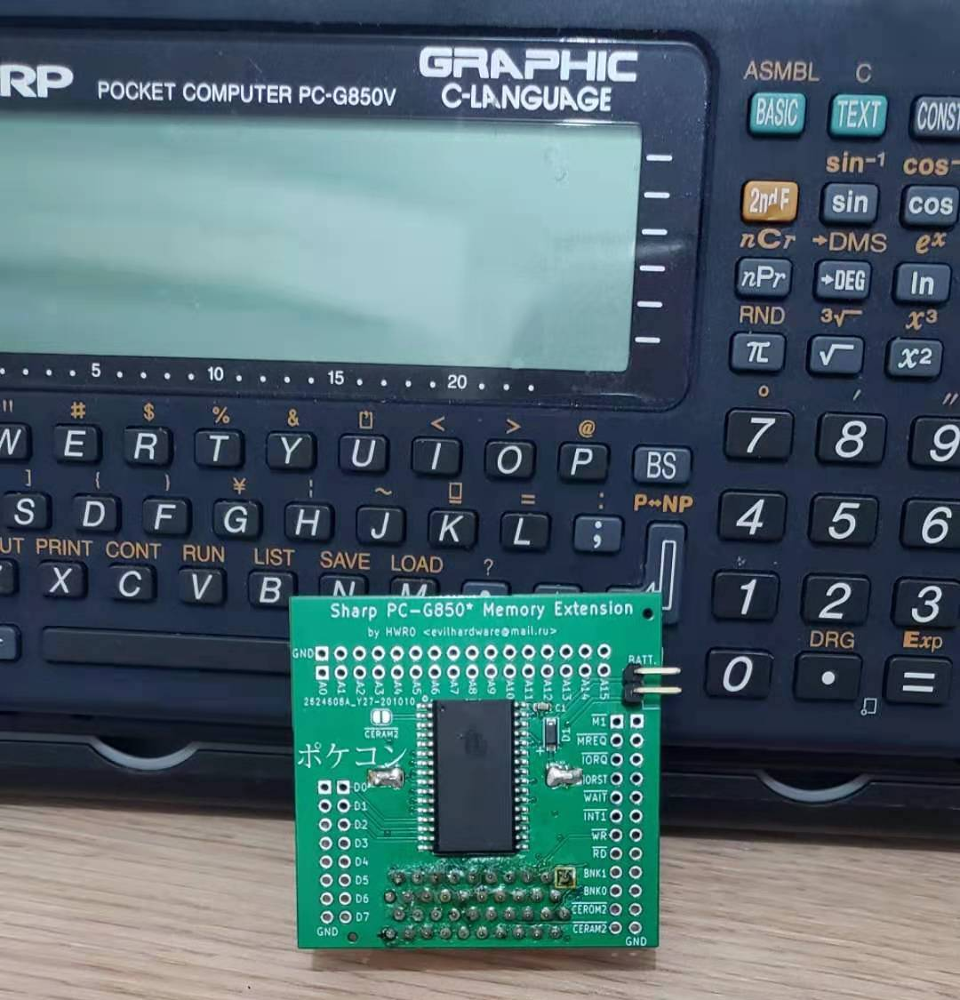